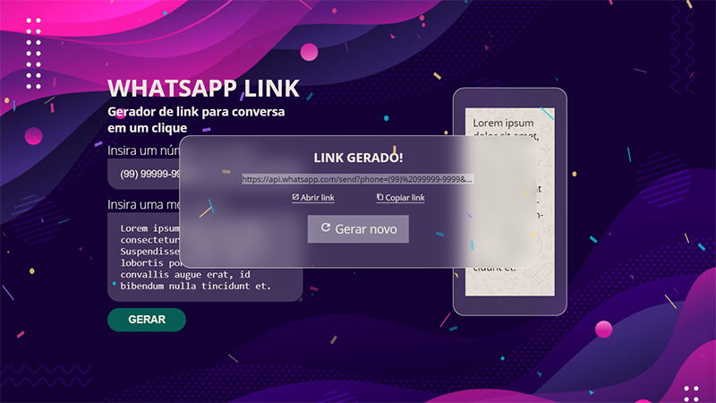

# WHATSAPP LINK

## Introdução
Projeto criado para estudar manipulação de DOM e uso de dados obtidos através de inputs com Javascript.

Foi utilizado o recurso de "Click to Chat" do WhatsApp que faz com que assim que uma pessoa clique em um link, uma janela do WhatsApp seja aberta em seu celular ou na página web, com uma mensagem pré-programada e um destinatário definido, onde ela pode conversar diretamente com a empresa sem a necessidade de salvar o número. O que essa aplicação faz é criar esse link para que ele possa ser compartilhado.

## Techs utilizadas
* HTML: para estruturação da página;
* CSS: para estilização;
* JavaScript: para manipulação dos dados e geração do link;
* [Tilt.js](https://micku7zu.github.io/vanilla-tilt.js/): biblioteca javascript que cria animação 3d;
* [Confetti.js](https://github.com/Agezao/confetti-js): biblioteca javascript que cria efeito de confetti.
